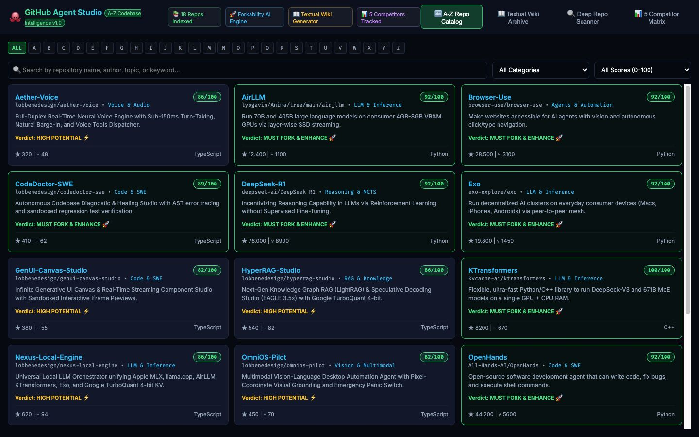

# 🐙 GitHub Agent Studio

[](https://bun.sh/)
[](https://www.typescriptlang.org/)
[](LICENSE)
[](#-features)

[English 🇬🇧](#english) • [Italiano 🇮🇹](#italiano)

> **The Universal A-to-Z GitHub Repository Intelligence & Forkability Classifier. Scans open-source codebases, calculates strategic impact scores (0–100), and generates clean text-only Markdown Wiki archives with direct access links.**
>
> *L'intelligenza universale per GitHub che classifica da A a Z tutti i repository open source, valuta l'impatto strategico del codice (0–100) e genera archivi Wiki testuali in Markdown pulito con link diretti di accesso.*



---

<a name="english"></a>
## 🇬🇧 English Documentation

### 🏆 Why GitHub Agent Studio is Essential for AI Engineering

Navigating millions of GitHub repositories without knowing which projects are truly worth forking or studying leads to wasted engineering hours. **GitHub Agent Studio** provides:

1. **🔤 Comprehensive A-to-Z Categorization**:
   * Indexes and filters repositories alphabetically from A to Z across LLMs, Agents, Vision, Voice, MCTS, and SWE.
2. **🔬 Deep Code & Architecture Evaluator**:
   * Analyzes repo structure, AST complexity, community velocity, and self-hostability to compute an objective **Strategic Score (0–100)** and a clear verdict (`MUST FORK & ENHANCE 🚀`, `HIGH POTENTIAL ⚡`, `MONITOR 👁️`, `IGNORE 🚫`).
3. **📖 Clean Textual Wiki Archive Generator**:
   * Generates structured, image-free Markdown documentation with direct clickable URLs and strategic enhancement roadmaps in one click.
4. **🔍 Custom Repo Scanner**:
   * Paste any GitHub repository URL to immediately crawl, evaluate, and add it to your intelligence index.

---

### 📊 Benchmark: GitHub Agent Studio vs. Top 5 Competitors

| Metric / Feature | 🐙 **GitHub Agent Studio** | **GitHub Trending** | **OSS Insight** | **GitHunt** | **Awesome Lists** |
| :--- | :---: | :---: | :---: | :---: | :---: |
| **A-to-Z Alphabetical Index** | **✓ Built-in** | ✗ No | ✗ No | ✗ No | ✓ Static text |
| **Deep Code Quality Score**| **✓ Yes (0-100)** | ✗ Stars only | ✗ Metrics only | ✗ Stars only | ✗ No |
| **Forkability Recommendation**| **✓ Built-in** | ✗ No | ✗ No | ✗ No | ✗ No |
| **Textual Wiki Generator** | **✓ 1-Click Export** | ✗ No | ✗ No | ✗ No | ✗ Manual |
| **1-Click Local Clone** | **✓ Built-in** | ✗ CLI only | ✗ No | ✗ No | ✗ No |
| **100% Local Privacy** | **✓ Local Bun** | ✗ Cloud | ✗ Cloud | ✗ Cloud | ✓ Static |

---

### 🛠️ Quick Start

```bash
# 1. Clone the repository
git clone https://github.com/lobbenedesign/github-agent-studio.git
cd github-agent-studio

# 2. Run with Bun
bun server.ts
```

Open your browser at **`http://localhost:3011`**.

---

<a name="italiano"></a>
## 🇮🇹 Documentazione in Italiano

### 🏆 Perché GitHub Agent Studio è Fondamentale

1. **🔤 Classificazione da A a Z**: Ordina ed esplora tutti i progetti open-source per lettera alfabetica e categoria.
2. **🔬 Analisi del Codice & Indice di Forkabilità (0-100)**: Legge l'architettura dei file e ti dice subito se il progetto è da forkare (`MUST FORK 🚀`), da monitorare (`MONITOR 👁️`) o da ignorare (`IGNORE 🚫`).
3. **📖 Archivio Wiki Testuale con Link Diretti**: Genera in un istante un indice pulito in Markdown senza immagini, perfetto per studio e archiviazione strategica.
4. **🔍 Scanner per Qualsiasi Repository**: Inserisci qualsiasi link GitHub per analizzarlo e inserirlo nell'indice.

---

### 🛠️ Avvio Rapido

```bash
git clone https://github.com/lobbenedesign/github-agent-studio.git
cd github-agent-studio
bun server.ts
```

Apri il browser all'indirizzo **`http://localhost:3011`**.

---

## 📄 License
Released under the [MIT License](LICENSE).
